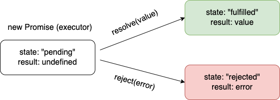

# Bölüm 18

# Promise, async/await

Bir popüler kitap yazarı olduğunuzu ve belirli bir günde yeni bir kitap yayınlamayı planladığınızı hayal edin. Bu kitaba ilgi duyan okuyucular, bu kitabı listelerine ekliyor ve yayınlandığında veya yayın tarihi ertelendiğinde bile bilgilendiriliyor. Yayın günü geldiğinde, herkes bilgilendirilir ve kitabı satın alabilir ve tüm taraflar mutlu olur. Bu, programlamada gerçekleşen gerçek hayattan bir analojidir.

1. Bir "_producing code_" (_üreten kod_) zaman alan ve bir şeyleri başaran bir şeydir. Burada kitap yazarı.
2. Bir "_consuming code_" (_tüketen kod_) üreten kodu hazır olduğunda tüketen kişidir. Bu durumda "okur"dur.
3. "üreten kod" ile "tüketen kod" arasındaki bağlantı, sonuçları "üreten kod" dan "tüketen kod" a ulaştıracağı için bir sözleşme olarak adlandırılabilir.

# Promise

Yaptığımız analoji, JavaScript promise nesnesi için de geçerlidir. promise nesnesi için kurucu sözdizimi şöyledir:

```javascript
let promise = new Promise(function (resolve, reject) {
  // executor (the producing code, "writer")
});
```

Burada, `new Promise`'ye bir işlev geçirilir, buna executor da denir ve oluşturulurken otomatik olarak çalışır. Sonuç veren üreten kodu içerir. `resolve` ve `rejects` JavaScript tarafından sağlanan ve sonuçlar üzerine çağrılan argümanlardır.

- `resolve(value):` sonuç üzerine value döndüren bir callback fonksiyonu
- `reject(error)`: hata üzerine `error` döndüren bir callback fonksiyonu, bir error nesnesi döndürür



`new Promise` kurucusu tarafından döndürülen `promise` nesnesinin iç özellikleri şunlardır:

- `state` - başlangıçta `pending`, ardından `fulfill` olmak üzere üzerine resolve veya `rejected` üzerine `reject` çağrıldığında değişir

- result - başlangıçta `undefined`, ardından `resolve` üzerine `value` veya `reject` üzerine `error` değişir


Promise özelliklerine `state` ve `result` erişilemez. Promise'leri işlemek için promise yöntemlerine ihtiyaç vardır.


Promise örneği:

```javascript
let promiseOne = new Promise(function (resolve, reject) {
  // the function is executed automatically when the promise is constructed

  // after 1-second signal that the job is done with the result "done"
  setTimeout(() => resolve("done"), 1000);
});

let promiseTwo = new Promise(function (resolve, reject) {
  // the function is executed automatically when the promise is constructed

  // after 1-second signal that the job is done with the result "error"
  setTimeout(() => reject(new Error("Whoops!")), 1000);
});
```

Burada, `promiseOne` "yerine getirilmiş promise" örneğidir, çünkü değerler başarıyla çözüldüğünden, `promiseTwo` ise reddedildiği için "reddedilmiş promise" örneğidir. Reddedilmiş veya yerine getirilmiş bir promise, yerleşik promise olarak adlandırılır, aksine başlangıçta bekleyen promise. Promise'den tüketen fonksiyon `.then` ve `.catch` yöntemleri kullanılarak kaydedilebilir. Ayrıca, önceki yöntemlerin tamamlanmasından sonra temizleme veya sonlandırma için `.finally` yöntemini de ekleyebilirsiniz.

```javascript
let promiseOne = new Promise(function (resolve, reject) {
  setTimeout(() => resolve("done!"), 1000);
});

// resolve runs the first function in .then
promiseOne.then(
  (result) => alert(result), // shows "done!" after 1 second
  (error) => alert(error) // doesn't run
);

let promiseTwo = new Promise(function (resolve, reject) {
  setTimeout(() => reject(new Error("Whoops!")), 1000);
});

// reject runs the second function in .then
promiseTwo.then(
  (result) => alert(result), // doesn't run
  (error) => alert(error) // shows "Error: Whoops!" after 1 second
);

let promiseThree = new Promise((resolve, reject) => {
  setTimeout(() => reject(new Error("Whoops!")), 1000);
});

// .catch(f) is the same as promise.then(null, f)
promiseThree.catch(alert); // shows "Error: Whoops!" after 1 second
```


`Promise.then()` metodunda, her iki callback argümanının da kullanımı isteğe bağlıdır.

